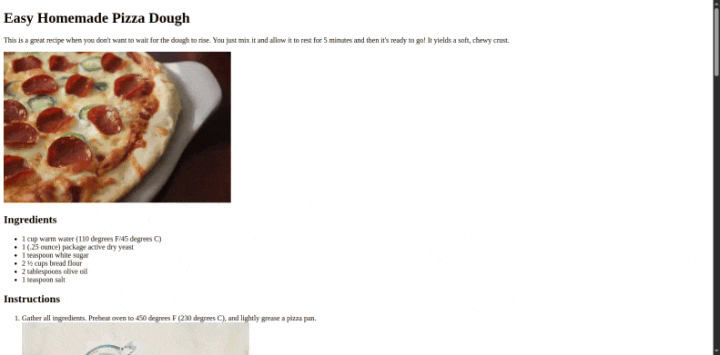

# Recipe Page 🍕

This is a simple page that showcases a delicious recipe.

---

## Technologies Used 💻

- **HTML**

---

## Preview 🎥



---

## Live Demo 🌐

Check out the live demo of the project here: [Live Demo](https://elhostakosta.github.io/recipe-page/)

---

## How to Use 🚀

1. **Clone the Repository**:
    ```bash
    git clone https://github.com/elhostakosta/recipe-page.git
    ```
2. **Open the Project**:
    Navigate to the project folder and open the `index.html` file in your favorite web browser.

---

## Credits 🙌

- **Image and Recipe Source**: [AllRecipes](https://www.allrecipes.com/recipe/20171/quick-and-easy-pizza-crust/)

---

## License 📜

This project is open-source and available under the [MIT License](LICENSE). Feel free to use, modify, and share it!